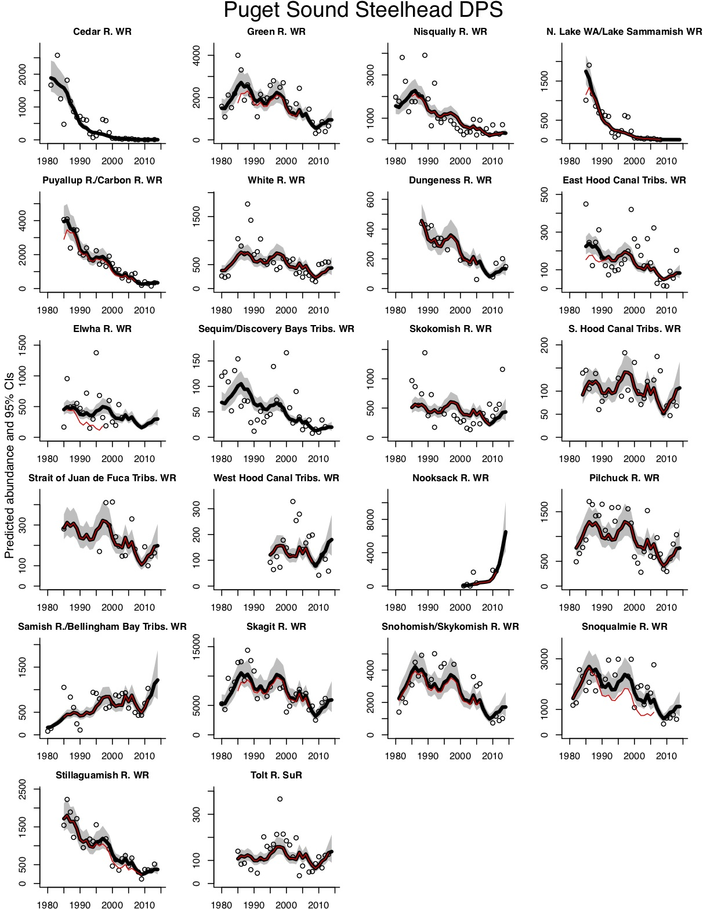

# NWCTrends

This is runs the standardized trends metrics used in the 2015 5-year Status Review Update for listed PNW salmonids.  

## Installation

To install, install the **devtools** package (if needed) from CRAN and then use:
```
library(devtools)
devtools::install_github("nwfsc-timeseries/NWCTrends")
```
To install an R package from Github, you need to be able to build an R package on your machine. If you are on Windows, that means you will need to install [Rtools](https://cran.r-project.org/bin/windows/Rtools/). On a Mac, installation should work fine; you don't need to install anything.

The default is to create an html file with the tables and figures. You can also select Word or PDF output. In order to create PDF files and tables, you also need to install **tinytex** if you do not have a TeX installation. Code to install **tinytex** is below.  

```
install.packages('tinytex')
tinytex::install_tinytex()
```

## Instructions to run a demo

To download a set of demo files, run the following code.
```
fpath <- system.file("doc","demodata",package="NWCTrends")
file.copy(fpath, ".",recursive=TRUE)
```
This will create a folder called `demodata` in your directory.

To run a demo analysis and create a report, type 
```
library(NWCTrends)
NWCTrends_report()
```
You will be asked to select a data file. If you do not have data, navigate to one of the .csv or .RData files in the `demodata` folder.

Type `?NWCTrends` for instructions for analyzing a data set. The data must be .csv file. Figures will be saved in the **NWCTrends_output** folder, created in your working directory.  

## Instructions to run your own data

Download the demo data files and duplicate the format. Do not rename the columns. Missing data are entered with a -99. An ESU name and a unique population name (COMMON_POPULATION_NAME) is required. The tables produced by **NWCTrends** only use the BROOD_YEAR, NUMBER_OF_SPAWNERS, and FRACWILD columns. An entry is required for each year. RUN_TIME, SPECIES and MAJOR_POPULATION_GROUP are used to adding labels to plots and tables.

## Modifying the tables

Set the years to use for the analysis using `fit.min.year` and `fit.max.year`. 

In the tables for the geometric means, you can control the table by passing in the list `geomean.table.control`. For example, you can set the beginning and ending years to be shown in the table. These can be different than `fit.min.year` and `fit.max.year`. For example, you may want to fit to 1990 to 2019 data but only show
5-year geometric means for 1999 to 2018. To do this, you would call the report with

```
NWCTrends_report(fit.min.year=1990, fit.max.year=2019,
                 geomean.table.control=list(min.year=1999, max.year=2018, change.col="first.last"))
```
The `change.col` argument determines whether the last column is the percent change between the first and last 5-year bands or between the last two bands.

The code will create bands with 5 years in each band starting with min.year. If max.year,
would lead to a final band with less than 5 years, then the last band will not have 5
years. If it has fewer than min.band.points, then the last band will be NA.
You will need to properly choose min.year and max.year to get the table to look as you want.


## References

The 2015 Status Review report can be viewed from the R command line by typing
```
RShowDoc("2015 Status Review Update",package="NWCTrends")
```
after installing the NWCTrends package. Or go to the GitHub repository and navigate to the "\inst\doc" folder on GitHub.

A pdf of the methods alone is also available by typing
```
RShowDoc("Methods",package="NWCTrends")
```
at the command line or navigate to the "\inst\doc" folder on GitHub.

## Example output


A report will be generated with figures and tables. [Example report](inst/doc/example.html)

The main figure shows the estimated trends.



